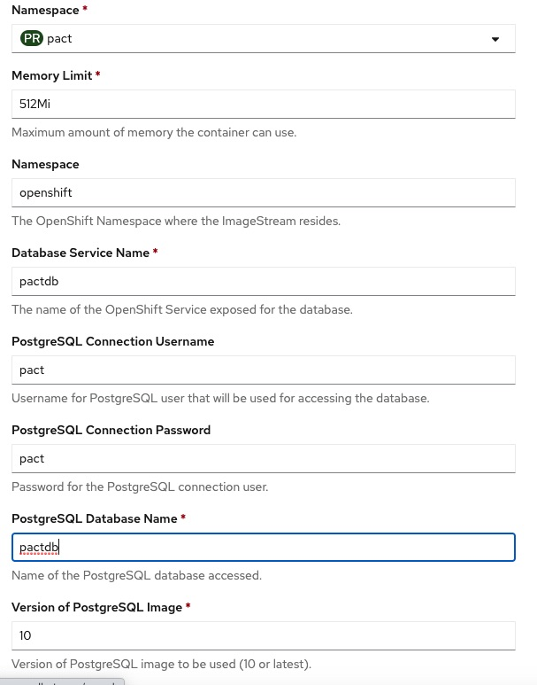

# November 2020 Minneapolis RHUG

## Description
This respository contains assets used in the demonstration on Event Driven Computing - The Next Frontier held in the Minneapolis
November 17, 2020 Red Hat User Group.  The main assets in the repository are contained in the sub folders and are the following

- **pactproducer**\
This is a service that provides the REST endpoint which is the entry point into collecting intial data about a contact event.  The
service is developed in java SpringBoot and is deployed as a knative service on OpenShift.  The service is exposed via an HTTP POST at /pact/producer and receives a commma delimited payload under the key of message.  The payload format is id1,id2,gpsloc1,gpsloc2 
(ex: 1,2,44.986656,-93.258133).  The payload is placed on a kafka topic.

- **pactquerysvc**\
This is a service that provides a REST endpoint which is used to query the data that has been collected throughout the process in a
series of event streams.  The service is developed in java SpringBoot and is deployed using a kubernetes deployment to OpenShift.
The service is exposed via an HTTP GET and exposes two endpoints /findcontactbystate?state=<state> and /findcontactbycountry?country=<country>

- **pact-contact-log**\
This is a service that provides a Kubernetes service endpoint which is bound to by a knative event source and persists the data
it receives in a Postgresql database

- **pactcamelkrte**\
This is a camelk integration route implemented in java DSL which uses camel kafka connector to consume data from a kafka topic, enriches
the data using a MapQuest API to add address information based on gps coordinate input it receives, and then places enriched data onto a
kafka topic (**Note:** You will need to create your own key on Mapquest for the Mapquest API call that is performed)

The following image illustrates the flow between the service components of the demo

## Demo Pre-requisites:
1. An OpenShift 4.5(+) cluster with admin access
2. Creation of a non-admin user with identity of pactdev
3. Creation of a knative-eventing and knative-serving projects in OpensShift cluster required for Knative Services
4. Installation of ko cli for deploying kubernetes CRD's for knative kafka source (<https://github.com/google/ko>)
5. Deployment of Knative Kafka Event Source CRD's into OpenShift cluster (<https://github.com/knative/eventing-contrib/blob/master/DEVELOPMENT.md#checkout-your-fork>)
6. Installation of oc command line interface
7. Installation of Knative kn command line interface
8. Installation of Tekton tkn command line interface

## Demo Flow
The demo flow spans two actors an OpenShift cluster administrator as a cluster operator and a developer

> **Operator** (Steps performed using OpenShift Admin Web Console)
1. Create a project with the name of pact
2. Using OpenShift OperatorHub, Install Kafka Operator using *"Red Hat Integration - AMQ Streams operator"* in **all namespaces**
3. Using OpenShift OperatorHub, Install Serverless Operator Using *"OCP Serverless Operator"* in **all namespaces**
4. Using OpenShift OperatorHub, Install *"Tekton Operator"* in **all Namespaces**
5. Change to knative-eventing project and create *"Knative Eventing Instance"* using installed Serverless Operator 
6. Change to knative-serving project and create *"Knative Serving Instance"* using installed Serverless Operator
7. Deploy Knative Eventing CRD/API’s (use 7-op-createknkafkasource.sh <helperscripts/7-op-createknkafkasource.sh> see notes)
8. Using OpenShift OperatorHub, Install *"CamelK Operator"* in **pact namespace**
9. From Developer Console/Project/Project Access  provision pactdev user admin rights to pact project

> **Developer**
1. Login into OpenShift Admin Conole as pactdev user
2. Change to Administrator Console
3. Change to pact Project
4. Create *"Kafka Broker*" named pact-cluster using installed Kafka Operator
5. Create *"Kafka Topic*" named pact-translated using installed Kafka Operator
6. Create *"Kafka Topic*" named pact-untranslated using installed Kafka Operator
7. Change to Developer Console
8. Using Postgresql Ephemeral Template create a postgresql database

9. Deploy pactquery as deployment with pipeline
10. Deploy serverlessdemo as knative (pact-contact-log-svc)
11. Deploy pact producer as knative
12. Deploy knative kafka event source using oc apply -f event-source.yaml
13. Deploy CamelK integration kamel run -d mvn:org.apache.clerezza.ext:org.json.simple:0.4 PactTranslationBridge.java (use 16-deploycamelk.sh)
